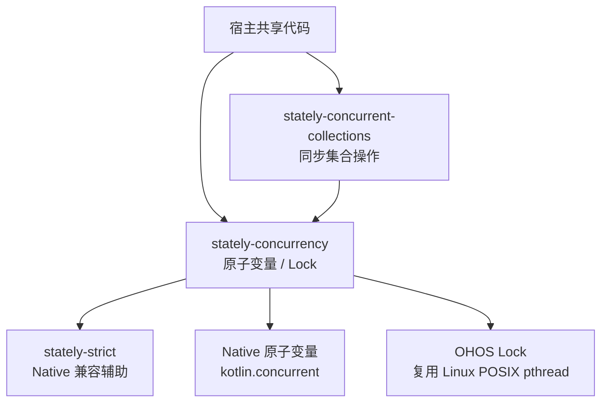
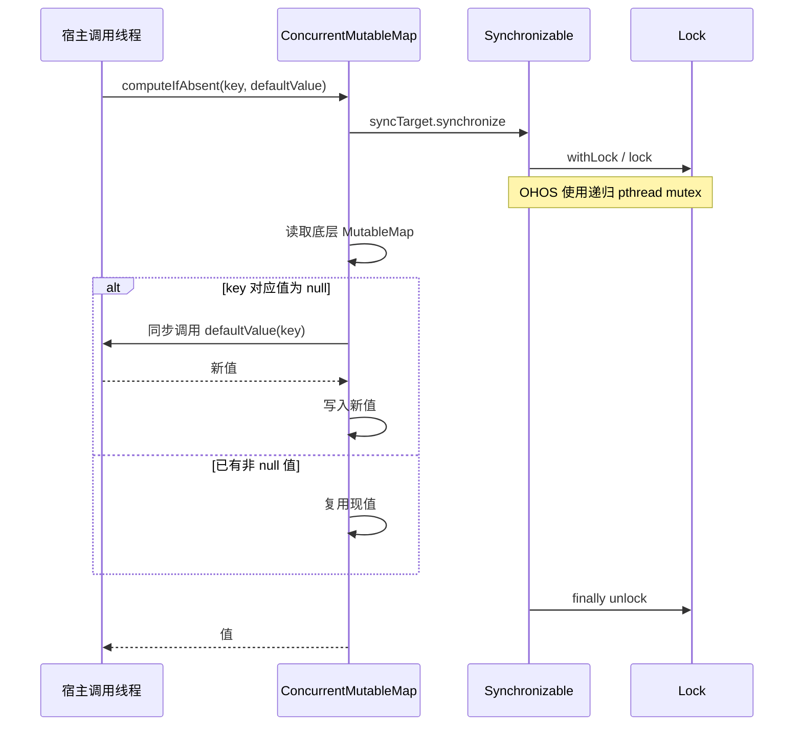
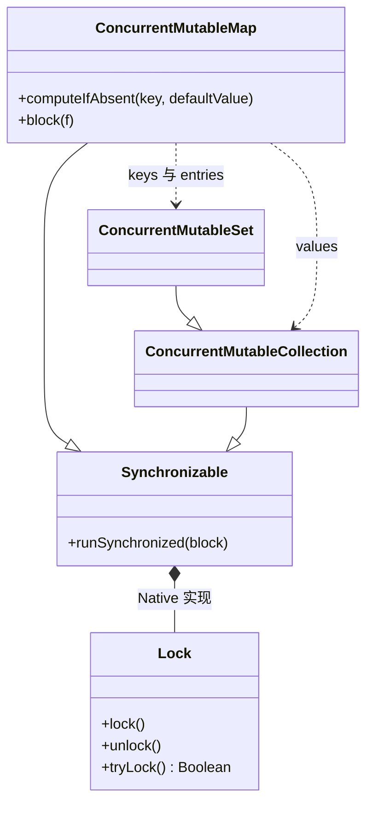

# GY CrossKit Stately OpenHarmony

为 Android、iOS 和 OpenHarmony 的 Kotlin Multiplatform 共享代码提供原子变量、锁及线程安全集合。基于 [Touchlab Stately 2.1.0](https://github.com/touchlab/Stately)，保留 `co.touchlab.stately` API，增加 `ohosArm64` 发布变体。

## 模块与平台

| 模块 | 用途 |
| --- | --- |
| `stately-concurrency` | `AtomicInt`、`AtomicReference`、`Lock` 等并发原语；传递依赖 `stately-strict` |
| `stately-concurrent-collections` | `ConcurrentMutableMap`、List、Set 等线程安全集合；传递依赖 `stately-concurrency` |
| `stately-strict` | Native 线程标注与内存模型兼容辅助功能，通常随上述模块传递引入 |

三个模块均发布 JVM（Android 使用）、`iosArm64`、`iosSimulatorArm64`、`iosX64` 和 `ohosArm64`。上游旧的隔离集合模块及其他平台变体不在本 fork 的发布范围内。

当前发布使用 Kotlin `2.2.21-1.0.0` 的 OpenHarmony 工具链；普通 Kotlin `2.2.21` 不提供 `ohosArm64()`。建议消费者使用相同工具链。源码构建基线为 JDK 17 / Gradle 8.11；JVM 字节码目标为 Java 8，iOS 编译/链接需要 macOS / Xcode，OHOS 需要 Native SDK。未独立确定最低 iOS / OpenHarmony 系统版本。

## 架构与调用流程

图示覆盖本 fork 维护的三个发布模块与 OHOS 锁接点，保留 Touchlab Stately 的 API；旧隔离集合不纳入图示或发布范围。适配维护分支仍为 `codex/ohos-2.1.0`。



下面以 `ConcurrentMutableMap.computeIfAbsent` 为例。默认值函数在锁内同步执行；集合不创建 dispatcher、协程或后台线程。





源码：[OHOS source set 接线](stately-concurrency/build.ohos.gradle.kts)、[Map 与锁域共享](stately-concurrent-collections/src/commonMain/kotlin/co/touchlab/stately/collections/ConcurrentMutableMap.kt)、[Set](stately-concurrent-collections/src/commonMain/kotlin/co/touchlab/stately/collections/ConcurrentMutableSet.kt)、[Collection](stately-concurrent-collections/src/commonMain/kotlin/co/touchlab/stately/collections/ConcurrentMutableCollection.kt)、[Native Synchronizable](stately-concurrency/src/nativeMain/kotlin/co/touchlab/stately/concurrency/Functions.kt)、[Lock / withLock](stately-concurrency/src/commonMain/kotlin/co/touchlab/stately/concurrency/Lock.kt)、[OHOS 复用的 POSIX 实现](stately-concurrency/src/linuxMain/kotlin/co/touchlab/stately/concurrency/Lock.kt)。

单次操作同步；跨多次调用的业务事务由宿主使用 `block` 等明确包围。Native [AtomicInt](stately-concurrency/src/nativeMain/kotlin/co/touchlab/stately/concurrency/AtomicInt.kt) 使用 Kotlin 原子操作；[strict 兼容实现](stately-strict/src/nativeMain/kotlin/co/touchlab/stately/strict/Helpers.kt) 在当前内存模型下不冻结对象。显式使用 `Lock.close()` 前必须结束全部持锁与待锁调用；集合没有公开关闭入口，不要据图为它补造释放 API。

## 安装

在项目的 `settings.gradle.kts` 中加入 JitPack：

```kotlin
dependencyResolutionManagement {
    repositories {
        google()
        mavenCentral()
        maven { url = uri("https://jitpack.io") }
    }
}
```

在共享模块的 `build.gradle.kts` 中按需添加模块。下面的集合依赖也会引入并发原语：

```kotlin
kotlin {
    sourceSets {
        commonMain.dependencies {
            implementation("com.github.gycrosskit.stately-ohos:stately-concurrent-collections:2.1.0-ohos-2.2.21-10")
        }
    }
}
```

仅需原子变量和锁时，改用 `com.github.gycrosskit.stately-ohos:stately-concurrency:2.1.0-ohos-2.2.21-10`。消费者依赖根模块即可，由 Gradle 元数据选择平台产物。

## 快速使用

在 `commonMain` 中使用，无需平台初始化：

```kotlin
import co.touchlab.stately.collections.ConcurrentMutableMap
import co.touchlab.stately.concurrency.AtomicInt

val counter = AtomicInt(0)
val next = counter.incrementAndGet()
val cache = ConcurrentMutableMap<String, Int>()
cache["count"] = next
val value = cache["count"]
```

集合保证单次操作的同步；连续读取再写入仍不是一个原子操作。Map 的复合操作可使用 `computeIfAbsent` 或 `block`，具体行为见[源码](stately-concurrent-collections/src/commonMain/kotlin/co/touchlab/stately/collections/ConcurrentMutableMap.kt)。

## 与上游依赖混用

本 fork 的 Maven 组名是 `com.github.gycrosskit.stately-ohos`，Native KLIB 身份仍是上游 `co.touchlab`。当其他库传递引入官方 Stately 时，在消费模块的 `build.gradle.kts` 中替换官方坐标，避免同一二进制装入两套同名 KLIB：

```kotlin
configurations.configureEach {
    resolutionStrategy.dependencySubstitution {
        listOf("stately-strict", "stately-concurrency", "stately-concurrent-collections").forEach { name ->
            substitute(module("co.touchlab:$name"))
                .using(module("com.github.gycrosskit.stately-ohos:$name:2.1.0-ohos-2.2.21-10"))
        }
    }
}
```

## 文档与支持

- [构建与验证](OHOS_PORT.md)：适配实现、发布及现有验证范围。
- [上游英文介绍](README_EN.md)、[Touchlab Stately](https://github.com/touchlab/Stately)：通用 API 和项目来源；上游坐标不含本 fork 的鸿蒙适配。
- [GitHub Releases](https://github.com/gycrosskit/stately-ohos/releases)：版本与 Maven 发布归档。
- [GitHub Issues](https://github.com/gycrosskit/stately-ohos/issues)：提供模块、工具链、平台和最小复现。

已有验证通过 Koin 独立消费工程覆盖 Android 编译、iOS KLIB 编译与模拟器 Framework 链接、OHOS 动态库链接及 JVM 注入运行。iOS/OHOS 设备运行尚未验证。

适配维护在 `codex/ohos-2.1.0`，默认 `main` 保留上游基线。本 fork 与上游 Stately 均遵循 Apache-2.0，见 [LICENSE.txt](LICENSE.txt)。
